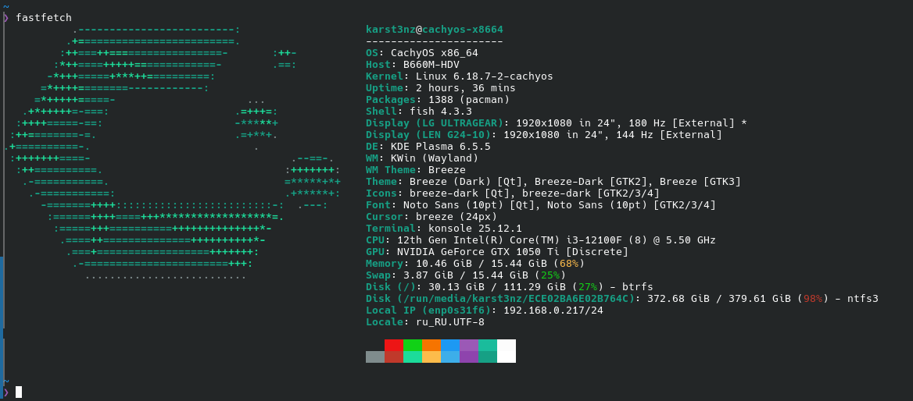

# terminal_lyrics

Display synchronized lyrics in your terminal, fetched automatically for the song playing in your MPRIS-compatible music player.
1
`terminal_lyrics` connects to music players like Spotify, VLC, and others on Linux via the MPRIS D-Bus interface. It identifies the currently playing track, fetches its lyrics from online sources, and displays them in your terminal, highlighting the current line in sync with the music.

**Tested on CachyOS (ArchLinux)**


## Features

*   **Synchronized Lyrics Display**: Shows LRC format lyrics that scroll in time with your music.
*   **MPRIS Integration**: Automatically detects and connects to active MPRIS v2 compatible players (e.g., Spotify, VLC, Audacious).
*   **Multiple Lyrics Sources**: Fetches lyrics from various sources, including `lrclib.net` and `lyrics.ovh`.
*   **Intelligent Fallbacks**: If an exact match isn't found, it performs a broader search to find the correct lyrics. Plain (unsynchronized) lyrics are used as a fallback.
*   **Local Caching**: Caches lyrics in an SQLite database to minimize API requests and provide offline access.
*   **Responsive Terminal UI**: Uses an alternate screen buffer, renders with ANSI colors, and handles terminal resizing gracefully.
*   **Powerful CLI**: A command-line interface to watch lyrics, manage the cache, search for lyrics, and convert lyric formats.
*   **Configurable**: Customize behavior through environment variables.

## Example


## Installation

1.  **Prerequisites**: This tool is designed for Linux systems with a D-Bus session bus. You will need Python 3 and the system dependencies for `dbus-python`. On Debian/Ubuntu, you can install them with:
    ```bash
    sudo apt-get install python3-dev libdbus-1-dev
    ```

2.  **Clone the repository**:
    ```bash
    git clone https://github.com/karst3nz/terminal_lyrics.git
    cd terminal_lyrics
    ```

3.  **Install Python dependencies**:
    ```bash
    pip install -r requirements.txt
    ```

## Usage

The application is run as a Python module. The primary command is `watch`.

### Watch for Lyrics

To start displaying lyrics for the currently playing song, run:

```bash
python -m terminal_lyrics watch
```

This will clear the screen and show the lyrics, highlighting the active line. Press `Ctrl+C` to exit.

**Options for `watch`:**

*   `--player <name>`: Specify a preferred player (e.g., `vlc`, `spotify`).
*   `--refresh-hz <rate>`: Set the polling frequency in Hz (e.g., `10.0`). Default is `30.0`.
*   `--context <lines>`: Set the number of lines to show above and below the current line. Default is `1`.
*   `--no-alt-screen`: Disable the alternate screen buffer, printing lyrics directly into your current terminal session.
*   `--debug`: Enable verbose debug logging.

### List Available Players

To see a list of currently running MPRIS-compatible players that the tool can connect to:

```bash
python -m terminal_lyrics players
```

### Search for Lyrics

You can search for lyrics directly from the `lrclib.net` database.

```bash
# Search by query
python -m terminal_lyrics search -q "Nirvana Smells Like Teen Spirit"

# Search by artist and track
python -m terminal_lyrics search -a "Queen" -t "Bohemian Rhapsody"

# Output results as JSON
python -m terminal_lyrics search -t "Stairway to Heaven" --json
```

### Manage the Cache

Lyrics are cached to `~/.cache/terminal-lyrics/cache.sqlite3`. You can clear this cache using the CLI.

```bash
python -m terminal_lyrics cache --clear
```

### Export Lyrics

Convert a local `.lrc` file into other formats like SRT (SubRip subtitle) or a normalized LRC file.

```bash
# Export to SRT format and print to stdout
python -m terminal_lyrics export my_song.lrc --format srt

# Export to JSON and save to a file
python -m terminal_lyrics export my_song.lrc --format json --out my_song.json
```

## Configuration

The application can be configured using environment variables:

| Variable                      | Description                                                               | Default             |
| ----------------------------- | ------------------------------------------------------------------------- | ------------------- |
| `TERMINAL_LYRICS_PLAYER`      | Preferred MPRIS player name (e.g., `spotify`).                            | (none)              |
| `TERMINAL_LYRICS_SOURCES`     | Comma-separated list of sources to query.                                 | `lrclib`            |
| `TERMINAL_LYRICS_REFRESH_HZ`  | Screen refresh and player polling rate in Hertz.                          | `30.0`              |
| `TERMINAL_LYRICS_CONTEXT_LINES` | Number of context lines to display above and below the current lyric line.  | `1`                 |
| `TERMINAL_LYRICS_ALT_SCREEN`  | Set to `0` or `false` to disable the alternate screen buffer.               | `1` (enabled)       |
| `TERMINAL_LYRICS_LOG_LEVEL`   | Set the logging level (e.g., `DEBUG`, `INFO`, `WARNING`).                   | `INFO`              |

Example:
```bash
export TERMINAL_LYRICS_PLAYER="vlc"
export TERMINAL_LYRICS_SOURCES="lrclib,lyrics_ovh"
python -m terminal_lyrics watch
```

## How It Works

1.  **MPRIS Client**: The `MprisClient` connects to the session D-Bus and discovers active media players. It polls the selected player for track metadata (artist, title) and playback position.
2.  **Lyrics Service**: When the track changes, the `LyricsService` orchestrates the fetching process.
3.  **Cache**: The service first checks the local `LyricsCache` (an SQLite database) for the track. If found, the cached version is used.
4.  **Sources**: If not cached, it queries the configured online sources (`LrcLibSource`, `LyricsOvhSource`) in order. These sources handle the API requests, rate-limiting, and retries.
5.  **Parsing**: If synchronized lyrics (LRC format) are found, the text is parsed into a series of timed events.
6.  **Sync & Render**: The `LineTracker` uses the player's current position to efficiently find the active lyric line. The `AnsiRenderer` then draws the UI in the terminal, highlighting the current line and showing surrounding lines for context. If only plain lyrics are available, they are displayed without synchronization.
7.  **Watch Loop**: The main `watch` loop ties everything together, continuously polling for position, updating the display, and handling track changes.
